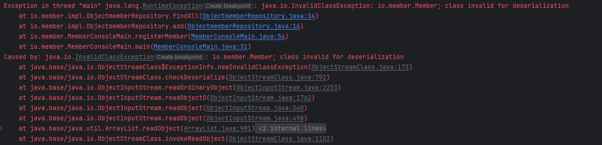

# ✏️ 학습내용
## 회원관리예제1 - 메모리
회원정보를 메모리로 보관하면 자바 프로그램이 종료되는 순간 데이터는 날아간다.

## 회원관리예제2 - 파일에보관
회원정보를 영구보존하려면 파일에 저장하면 된다. 자바는 다양한 타입을 사용해야하는데 모든것을 문자로 변경하여 저장하는 문제가 있따. 

## 회원 관리예제3 - DataStream
자바의 타입을 그대로 사용하면서 파일에 데이터를 저장하고 불러올수 있고, 구분자도 필요없다.

### DataStream의 원리
`writeUTF()`은 저장할때 2byte를 추가로 사용해서 앞에 글자의 길이를 저장한다. 그래서 dos.`writeUTF("id1");`을 싱행하면 "3id1" 형식으로 저장하고 읽을때 3이라는 길이를 숫자로 저장하고 글자를 읽어들인다.

```java
 1 101 1   
```
이상한 기호처럼 생긴것들이 길이를 나타내는 byte를 나타내는 것이다. 문자로 저장하는 것보다 byte로 저장하면 사이즈를 줄일 수 있다.

```java
    dos.writeUTF(member.getId());
    dos.writeUTF(member.getName());
    dos.writeInt(member.getAge());
```
DataStream의 **문제**는 멤버 데이터를 아이디,이름,나이를 따로따로 저장해야한다는 문제가 있다.  

## 회원 관리 예제4 - ObjectStream
회원 인스턴스도 메모리 어딘가에 보관되어있다. 메모리에 있는 객체를 읽어서 파일에 저장하기만 하면 아주 간단하게 인스턴스를 저장할 수 있다!
ObjectStream을 사용하면 회원 인스턴스를 파일에 편리하게 저장할 수 있다.

### 객체 직렬화
>인스턴스 -> 바이트 (직렬화)  
>바이트 -> 인스턴스 (역직렬화)

```java
public class Member implements Serializable {
    ...
}
```
```java
public class ObjectmemberRepository implements MemberRepository {
    private static final String FILE_PATH = "temp/members-obj.dat";
    
    @Override
    public void add(Member member) {
        List<Member> members = findAll();
        members.add(member);
    
        try(ObjectOutputStream oos = new ObjectOutputStream(new FileOutputStream(FILE_PATH))) {
            oos.writeObject(members);
        } catch (IOException e) {
            throw new RuntimeException(e);
        }
    }
    
    @Override
    public List<Member> findAll() {
        try (ObjectInputStream ois = new ObjectInputStream(new FileInputStream(FILE_PATH))) {
            Object findObject = ois.readObject();
            return (List<Member>) findObject;
        } catch (FileNotFoundException e) {
            return new ArrayList<>();
        } catch (IOException e) {
            throw new RuntimeException(e);
        } catch (ClassNotFoundException e) {
            throw new RuntimeException(e);
        }
    }
}
```
`Serializable` 인터페이스를 구현하지 않으면 직렬화 시 오류가 발생한다.


객체 직렬화는 초기에는 분산시스템에서 활용되었다. 객체직렬화는 시간이 지나면서 단점이 드러나고 대안기술이 등장하면서 사용이 많이 줄게 되었다. 현재는 거의 사용하지 않는다.

## XML, JSON, 데이터베이스
### 객체직렬화의 한계
- 버전관리가 어렵다.
  - 클래스 구조가 변경되면 직렬화된 객체와의 호환성 문제가 발생한다. 
- 자바에 종속적이라 시스템과의 상호 운용성이 떨어진다. 
- 성능이슈 - 직렬화/역직렬화 과정이 상대적으로 느리고 많은 리소스를 사용한다.

### 대안
1. XML  
복잡성과 무거움, 태그를 포함한 XML 문서의 크기가 커서 네트워크 전송비용도 증가하였다. 
2. JSON  
가볍고 간결, 현재는 사실상 표준기술임.
3. 
### 데이터 베이스
데이터를 저장할때 파일에 데이터를 직접저장하는 것은 큰 한계가 있다.
- 데이터의 무결성
- 데이터 검색관리의 비효율성
- 보안문제
- 대규모 데이터의 효율적인 백업과 복구 

이런 문제를 해결하면서 발전한 서버 프로그램이 데이터 베이스이다.   
인덱스를 지정하면 매우빠른 속도로 데이터를 찾을 수있다.

# #️⃣ 생각해볼 문제
## try-with-resource
`try-with-resource`구문을 사용하여 자동으로 자원을 정리한다. 인코딩정보가 없으면 시스템의 인코딩정보를 사용함

```java
try(BufferedWriter bw = new BufferedWriter(new FileWriter(FILE_PATH, UTF_8, true))) {
    bw.write(member.getId()+DELIMITER +member.getName()+DELIMITER +member.getAge());
    bw.newLine();
} catch(IOException e) {
    throw new RuntimeException(e);
}
```

## new ArrayList() VS List.of()
빈배열일때는 List.of()를 사용하는 것이 좋다. List.of()는 불변 빈리스트 객체를 반환한다.
# 💫 학습자료