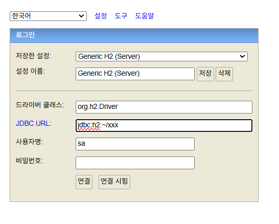
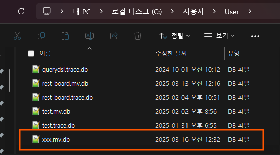

# H2 설정

처음 H2 실행 시 아래와 같은 화면이 나온다.



JDBC URL 에 경로를 입력하여 DB생성이 가능하다. 
```
jdbc:h2:<경로>/파일명
```

초기값 경로는 틸드(`~`)로 표시되어 있는데 이는 사용자 컴퓨터의 최상위 경로를 뜻한다.
원하는 경로로 지정도 가능하다.
경로와 사용자명,비밀번호를 지정후 연결 클릭


필자의 최상위 경로는 사용자>User이기에 xxx.mv.db라는 파일이 생겼다. 

이후에는 아래 URL로 접속하여 속도를 높인다 
```
jdbc:h2:tcp://localhost/<경로>/파일명 
```