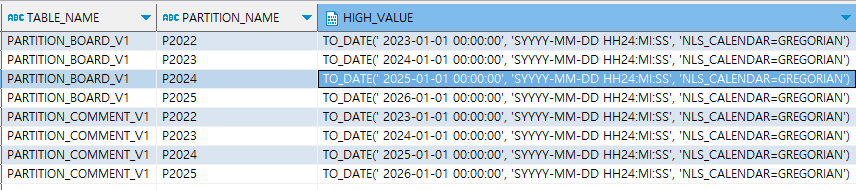

# 파티셔닝 예제

## ✅ 목표 정리
### 📌 게시글 테이블 (partition_board_v1)
- 파티셔닝 컬럼: reg_dt
- 파티셔닝 기준: 년도별 (2022, 2023, 2024, 2025)
- 레코드 수: 약 10,000건

### 📌 댓글 테이블 (partition_comment_v1)
- 파티셔닝 컬럼: prod_dt
- prod_dt는 게시글의 reg_dt와 같은 의미 (즉, 날짜 기반 연결)
- 파티셔닝 기준: 동일하게 년도별
- 컬럼: 파티셔닝 테스트 목적에 맞게 구성

# 테이블 생성
## 게시글 테이블: partition_board_v1
- 한번에 실행해야 파티션된 테이블이 생성된다.
```sql
CREATE TABLE partition_board_v1 (
  board_id     NUMBER PRIMARY KEY,
  title        VARCHAR2(200),
  content      CLOB,
  writer       VARCHAR2(50),
  reg_dt       DATE
)
    
PARTITION BY RANGE (reg_dt) (
  PARTITION p2022 VALUES LESS THAN (TO_DATE('2023-01-01', 'YYYY-MM-DD')),
  PARTITION p2023 VALUES LESS THAN (TO_DATE('2024-01-01', 'YYYY-MM-DD')),
  PARTITION p2024 VALUES LESS THAN (TO_DATE('2025-01-01', 'YYYY-MM-DD')),
  PARTITION p2025 VALUES LESS THAN (TO_DATE('2026-01-01', 'YYYY-MM-DD'))
);
```

## 댓글 테이블: partition_comment_v1
```sql
CREATE TABLE partition_comment_v1 (
  comment_id   NUMBER PRIMARY KEY,
  board_id     NUMBER,
  commenter    VARCHAR2(50),
  comment_text VARCHAR2(1000),
  prod_dt      DATE
)
PARTITION BY RANGE (prod_dt) (
  PARTITION p2022 VALUES LESS THAN (TO_DATE('2023-01-01', 'YYYY-MM-DD')),
  PARTITION p2023 VALUES LESS THAN (TO_DATE('2024-01-01', 'YYYY-MM-DD')),
  PARTITION p2024 VALUES LESS THAN (TO_DATE('2025-01-01', 'YYYY-MM-DD')),
  PARTITION p2025 VALUES LESS THAN (TO_DATE('2026-01-01', 'YYYY-MM-DD'))
);

```
### 외래키 설정(선택사항)
```sql
-- 외래키 설정(선택사항)
ALTER TABLE partition_comment_v1
ADD CONSTRAINT fk_comment_board
FOREIGN KEY (board_id)
REFERENCES partition_board_v1(board_id);
```


## 샘플 데이터 추가
```sql

-- 게시글 샘플
INSERT INTO partition_board_v1 VALUES (1, '2022 제목', '2022 내용', 'user1', TO_DATE('2022-06-01', 'YYYY-MM-DD'));
INSERT INTO partition_board_v1 VALUES (2, '2023 제목', '2023 내용', 'user2', TO_DATE('2023-03-15', 'YYYY-MM-DD'));
INSERT INTO partition_board_v1 VALUES (3, '2024 제목', '2024 내용', 'user3', TO_DATE('2024-07-20', 'YYYY-MM-DD'));
INSERT INTO partition_board_v1 VALUES (4, '2025 제목', '2025 내용', 'user4', TO_DATE('2025-01-05', 'YYYY-MM-DD'));

-- 댓글 샘플
INSERT INTO partition_comment_v1 VALUES (101, 1, '댓글러1', '2022 댓글입니다.', TO_DATE('2022-06-02', 'YYYY-MM-DD'));
INSERT INTO partition_comment_v1 VALUES (102, 2, '댓글러2', '2023 댓글입니다.', TO_DATE('2023-04-01', 'YYYY-MM-DD'));
INSERT INTO partition_comment_v1 VALUES (103, 3, '댓글러3', '2024 댓글입니다.', TO_DATE('2024-08-15', 'YYYY-MM-DD'));
INSERT INTO partition_comment_v1 VALUES (104, 4, '댓글러4', '2025 댓글입니다.', TO_DATE('2025-01-10', 'YYYY-MM-DD'));
```

## 파티션 확인용 쿼리
SELECT * FROM partition_board_v1
WHERE reg_dt = TO_DATE('2023-03-15', 'YYYY-MM-DD');

SELECT * FROM partition_comment_v1
WHERE prod_dt = TO_DATE('2024-08-15', 'YYYY-MM-DD');

## 전체 파티션 확인
SELECT table_name, partition_name, high_value
FROM user_tab_partitions
WHERE table_name IN ('PARTITION_BOARD_V1', 'PARTITION_COMMENT_V1');


## 게시판 테이블 데이터 만개삽입
```sql
BEGIN
  FOR i IN 1..10000 LOOP
    INSERT INTO partition_board_v1 (
      board_id, title, content, writer, reg_dt
    ) VALUES (
      i,
      '제목 ' || i,
      '내용 ' || i,
      'user' || MOD(i, 100), -- 100명의 사용자
      -- 2022~2025년 사이 날짜 랜덤 분산
      TO_DATE('2022-01-01', 'YYYY-MM-DD') + DBMS_RANDOM.VALUE(0, 1460)
    );
  END LOOP;

  COMMIT;
END;
```

### 댓글 데이터 만개 삽입
```sql
BEGIN
FOR i IN 1..10000 LOOP
    -- 댓글 3개씩 추가
    FOR j IN 1..3 LOOP
      INSERT INTO partition_comment_v1 (
        comment_id, board_id, commenter, comment_text, prod_dt
      ) VALUES (
        (i - 1) * 3 + j, -- 고유 comment_id
        i, -- 게시글 연결
        'commenter' || MOD(j, 50),
        '게시글 ' || i || '의 댓글 ' || j,
        -- 게시글과 유사한 날짜로 매핑
        (SELECT reg_dt FROM partition_board_v1 WHERE board_id = i)
      );
END LOOP;
END LOOP;

COMMIT;
END;
```


## 성능확인
```sql
EXPLAIN PLAN FOR
SELECT * FROM partition_board_v1
WHERE reg_dt BETWEEN TO_DATE('2023-01-01', 'YYYY-MM-DD') AND TO_DATE('2023-12-31', 'YYYY-MM-DD');

SELECT * FROM TABLE(DBMS_XPLAN.DISPLAY);
```

- 여기서 PARTITION RANGE SINGLE, PARTITION RANGE ITERATOR 등으로 표시되면 파티션 단위로 잘 걸러진다는 뜻이다.
- 반대로 PARTITION RANGE ALL이 나오면 모든 파티션을 훑는 거라서 최적화가 필요할 수 있다.

### 실제 실행 시간 비교 (AUTOTRACE)
다음 명령어로 쿼리 수행 시간 + 실행 계획 + 논리적 블록 읽기 수를 확인할 수 있어요.

```sql
SET AUTOTRACE ON;
SELECT * FROM partition_comment_v1
WHERE prod_dt >= TO_DATE('2024-01-01', 'YYYY-MM-DD');
-- AUTOTRACE는 SQL Developer나 SQL*Plus, TOAD 같은 툴에서 사용 가능합니다.
```

### 파티션 범위 조회해보기
쿼리가 특정 파티션만 읽는지 확인하는 방법:

```sql
SELECT * FROM partition_board_v1 PARTITION (p2023);
```
- 이렇게 직접 파티션 이름으로 조회하면 해당 파티션만 스캔하므로 훨씬 빠릅니다. 쿼리를 튜닝할 때, 자동으로 이 정도 수준으로 동작하는지 비교 용도로도 씁니다.

### 통계 정보 수집 (ANALYZE 또는 DBMS_STATS)
오라클 옵티마이저가 올바른 실행계획을 선택하게 하려면 통계 정보가 필요합니다.

``` sql
BEGIN
DBMS_STATS.GATHER_TABLE_STATS(ownname => 'YOUR_SCHEMA', tabname => 'PARTITION_BOARD_V1');
DBMS_STATS.GATHER_TABLE_STATS(ownname => 'YOUR_SCHEMA', tabname => 'PARTITION_COMMENT_V1');
END;
```
