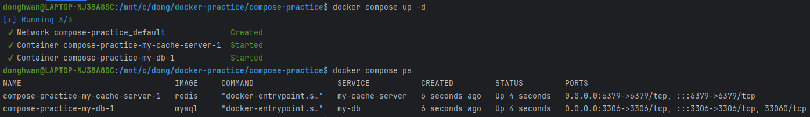
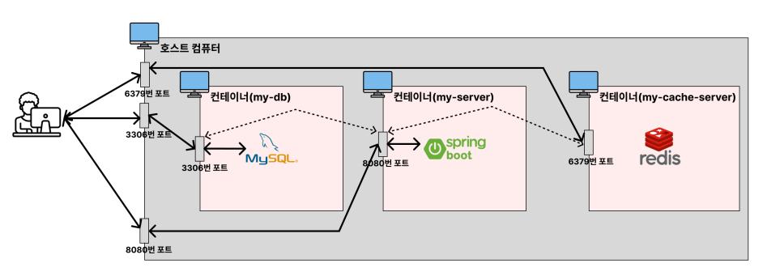

# Docker Compose를 활용해 2개이상의 컨테이너 관리하기

## mysql과 redis 동시에 띄우기
```
services:
  my-db:
    image: mysql
    environment:
      MYSQL_ROOT_PASSWORD: pwd1234
    volumes:
      - /docker-practice/mysql-data:/var/lib/mysql
    ports:
      - 3306:3306
  my-cache-server:
    image: redis
    ports:
      - 6379:6379
```


## springboot, mysql, redis 컨테이너 동시에 띄우기
compose.yml
```
services:
  my-server:
    build: .
    ports:
      - 8080:8080
    depends_on:
      my-db:
        condition: service_healthy # mysql이 정상적으로 작동하는지 확인되고 my-server를 실행할거야
      my-cache-server:
        condition: service_healthy # redis가 정상적으로 작동하는지 확인되고 my-server를 실행할거야

  my-db:
    image: mysql
    environment:
      MYSQL_ROOT_PASSWORD: pwd1234
      MYSQL_DATABASE: mysql
    volumes:
      - /docker-practice/mysql-data:/var/lib/mysql
    ports:
      - 3306:3306
    healthcheck:
      test: [ "CMD", "mysqladmin", "ping"]
      interval: 5s
      retries: 10

  my-cache-server:
    image: redis
    ports:
      - 6379:6379
    healthcheck:
      test: ["CMD","redis-cli","ping"]
      interval: 5s
      retries: 10

```
스프링 부트의 application.yml
```yaml
spring:
  datasource:
#    url: jdbc:mysql://localhost:3306/mydb << localhost에서 mysql을 찾을수 없다.
    url: jdbc:mysql://my-db:3306/mysql
    username: root
    password: pwd1234
    driver-class-name: com.mysql.cj.jdbc.Driver
  data:
    redis:
      host: my-cache-server
      port: 6379
```
>컨테이너를 띄웠는데 DB연결이 제대로 안된다면, 스프링부트의 application.yml을 확인해야한다. **컨테이너는 ip와 포트가 독립적**이기때문에 스프링부트의 컨테이너의 localhost에는 mysql이 없다. 다른 컨테이너에서 찾아야하는데, 이를 하기위해 도커에서는 service의 이름으로 외부 컨테이너의 서비스를 호출할 수 있도록 하였다.

