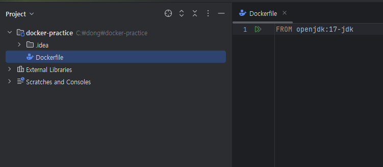
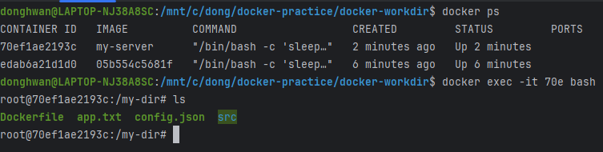

[# Dockerfile이란?

## Dockerfile이란?
Docker 이미지는 Dockerhub을 통해 다운받아서 사용할 수 있다. 이 Docker 이미지들도 누군가 만들어서 Dockerhub에 올려놓은 것이다.
그럼 도대체 이 Dcoker 이미지는 어떻게 만드는 걸까?
> Dockerfile이란 Docker 이미지를 만들게 해주는 파일이다.

## FROM:베이스 이미지 생성

### 베이스이미지
컨테이너를 띄울때 기본적으로 컨테이너 안에 어떤 프로그램을 설치하여 구성할것인지 선택하는 옵션. ex)JDK,node 등

```markdown
FROM openjdk:17-jdk 

ENTRYPOINT ["/bin/bash", "-c", "sleep 500"] # 500초 동안 시스템을 일시정지 시키는 명령어
```
FROM은 베이스 이미지라 이 도커파일로 이미지를 만들고 컨테이너를 띄웠을때 별다른 실행이 없으면 jdk만 설치하고 컨테이너가 종료된다. 디버깅을 확인하기 위해 
`ENTRYPOINT ["/bin/bash", "-c", "sleep 500"]` 소스를 추가하였다. 


#### 도커파일을 이미지로 만드는 명령어
⌨️ command: `docker build -t my-jdk17-server [Dockerfile이 있는 경로]`
#### 태그 붙여서 이미지 만들기
⌨️ command: `docker build -t my-jdk17-server:beta [Dockerfile이 있는 경로]`

## 종료된 컨테이너에 들어가서 디버깅하고 싶을 때
⌨️ command: `ENTRYPOINT ["/bin/bash", "-c", "sleep 500"]`

## COPY:파일복사(이동)
`COPY`는 호스트 컴퓨터에 있는 파일을 복사해서 컨테이너로 전달한다.

### 사용법
```
# 문법
COPY [호스트 컴퓨터에 있는 복사할 파일의 경로] [컨테이너에서 파일이 위치할 경로]

# 예시
COPY app.txt /app.txt
```

### case1. 컨테이너 내부로 호스트컴퓨터 파일 복사하기
Dockerfile
```
FROM ubuntu
COPY app.txt /app.txt
ENTRYPOINT ["/bin/bash", "-c", "sleep 500"] # 디버깅용 코드
```
현재 디렉토리에 있는 app.txt파일을 컨테이너의 루트경로에 app.txt 추가

### case2. 폴더안에 있는 모든 파일들 복사
```Dockerfile
FROM ubuntu
COPY my-app /my-app/
ENTRYPOINT ["/bin/bash", "-c", "sleep 500"] # 디버깅용 코드
```

### case3.폴더안에 있는 모든 파일들 복사
```bash
FROM ubuntu
COPY my-app /my-app/
ENTRYPOINT ["/bin/bash", "-c", "sleep 500"] # 디버깅용 코드
```

### case4.와일드 카드 사용하기
```
FROM ubuntu
COPY *.txt /text-files/
ENTRYPOINT ["/bin/bash", "-c", "sleep 500"] # 디버깅용 코드
```
### .dockerignore 사용하기
특정 파일 또는 폴더만 copy하지 않고 싶을때 활용한다.  
**.dockerignore**
```
readme.txt
```

### 빌드 및 실행확인
```text
$ docker build -t my-server .
$ docker run -d my-server
$ docker exec -it [Container ID] bash
$ ls
```

## ENTRYPOINT : 컨테이너가 시작할때 실행되는 명령어
`ENTRYOINT ["","",""]`

## 스프링 프로젝트 Docker로 실행시키기 
```text
FROM openjdk:21-jdk

COPY build/libs/*SNAPSHOT.jar app.jar

ENTRYPOINT ["java", "-jar", "/app.jar"]
```

## RUN: 이미지 생성과정에서 사용할 명령문 실행
### ✅ RUN vs ENTRYPOINT  
RUN 명령어와 ENTRYPOINT 명령어가 헷갈릴 때가 있다. 둘 다 같이 명령어를 실행시키기 때문이다. 하지만 엄연히 둘의 사용 용도는 다르다.  
`RUN` 은 ‘이미지 생성 과정’에서 필요한 명령어를 실행시킬 때 사용하고, `ENTRYPOINT` 는 생성된 이미지를 기반으로 컨테이너를 생성한 직후에 명령어를 실행시킬 때 사용한다.

```
FROM ubuntu

RUN apt update && apt install -y git

ENTRYPOINT ["/bin/bash", "-c", "sleep 500"]
```
컨테이너 환경이 ubuntu로 구성되었으면 좋겠고 git이 깔려있으면 좋겠다고 가정하자. 이런 환경을 구성하기 위해 Dockerfile 을 활용해 ubuntu, git이 깔려있는 이미지를 만들면 된다. 

## WORKDIR:작업 디렉토리를 지정
WORKDIR 으로 작업 디렉터리를 전환하면 그 이후에 등장하는 모든 RUN , CMD , ENTRYPOINT , COPY , ADD 명령문은 해당 디렉터리를 기준으로
실행된다. 

### ✅ 사용법
#### 문법
`WORKDIR [작업 디렉토리로 사용할 절대 경로]`
#### 예시
```
FROM ubuntu

WORKDIR /my-dir

COPY ./ ./

ENTRYPOINT ["/bin/bash", "-c", "sleep 500"]
```

카피하고자 하는 대상을 지정한 디렉토리에 추가하고, 컨테이너로 들어갔을때 최초 경로를 지정해준다.

## EXPOSE:컨테이너 내부에서 사용중인 포트를 문서화하기
EXPOSE 는 컨테이너 내부에서 어떤 포트에 프로그램이 실행되는 지를 문서화하는 역할만 한다. docker -p 8080:8080 … 와 같은 명령어의 -p 옵
션과 같은 역할은 일체 하지 않는다. 쉽게 표현하자면 EXPOSE 명령어는 쓰나 안 쓰나 작동하는 방식에는 영향을 미치지 않는다. 


## [실습] 웹 프론트엔드 프로젝트(Next.js)를 Docker로 배포하기
next 프로젝트 설치 후 Docker file
```
FROM node:20-alpine

WORKDIR /app

COPY . .

RUN npm install

RUN npm run build

EXPOSE 3000

ENTRYPOINT ["npm","run","start"]
```
.gitignore에 copy시 무시할 파일 지정
```
node_modules
```
빌드 후 실행
```
docker build -t my-app .

docker run -d -p 80:3000 my-web-server
```