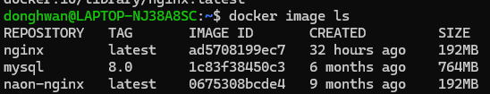
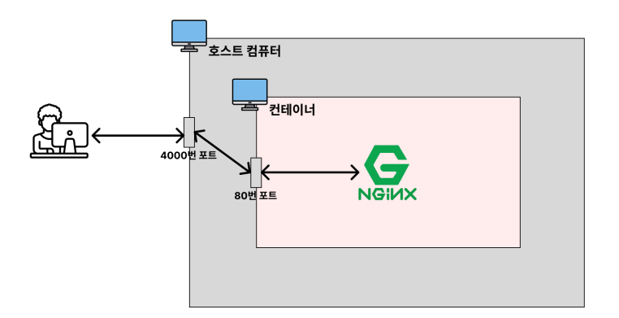

# 현업에서 자주 사용하는 Docker CLI
## Dockerhub
이미지를 저장 및 다운받을 수 있는 저장소 역할을 하고 있다. 

## 이미지 다운
⌨️ command:  `docker pull nginx:latest` : latest 태그는 최신버전을 가져온다.
태그를 통해 원하는 버전을 다운받을 수도 있다.
> **태그**는 각 이미지의 버전을 뜻한다.

## 이미지 조회/삭제
### 이미지 조회
⌨️ command: `docker image ls`

CREATED는 내가 다운받은 날짜가아니라, 이미지 개발자가 실제로 이미지를 생성한 날짜를 뜻한다.

### 이미지 삭제
⌨️ command: `docker image rm [이미지 ID]`  
❗일부만 입력해도 삭제해주는 기능이 있다.

#### 중단된 컨테이너에서 동작하는 이미지를 삭제하고 싶을경우 
⌨️ ️command: `docker rm -f [이미지 ID]`
아직 이해가 잘 안된다. 

#### 컨테이너에서 사용하고 있지 않은 전체 이미지를 삭제하는 명령어 (일단 그냥 외워)
⌨️ command: `docker image rm $(docker images -q)`

#### 중단된 컨테이너에서 사용하고 있지 않은 전체 이미지를 삭제하는 명령어 (일단 그냥 외워)
⌨️ command: `docker image rm -f $(docker images -q)`


## 컨테이너 생성/실행
### 컨테이너 생성
⌨️ command: `docker create [이미지 이름]`  
❗생성한것은 아직 실행된것이 아님, 컴퓨터만 있는상태
❗이미지가 없는 경우 자동으로 dockerhub에서 다운받아서 생성한다.

### 컨테이너 실행
⌨️ command: `docker start [컨테이너 ID]`

### 생성(create) + 실행(start) (포그라운드 환경)
⌨️ command: `docker run [이미지 ID]`  
❗도커의 실행순서를 알기 위해서 생성(create)과 실행(start)을 따로 알고 있어야한다.

### 생성(create) + 실행(start) (백그라운드 환경)
⌨️ command: `docker run -d [이미지 ID]`

```
포그라운드(foreground)
: 내가 실행시긴 프로그램이 화면에서 실행되고 출력되는 상태

백그라운드(background)
: 내가 실행시킨 프로그램이 컴퓨터 내부적으로 실행되는 상태
* 다른명령어를 사용할 수 있다.
```

### 컨테이너에 이름붙여서 백그라운드로 실행하기
⌨️ command: `docker run -d --name my-web-server [이미지 ID]`

### 호스트의 포트와 컨테이너의 포트를 연결하기

⌨️ command: `docker run -d -p [호스트 포트]:[컨테이너 포트] 이미지명[:태그명]`  
⌨️ ex: ` docker run -d -p 4000:80 nginx`  
docker run -p 4000:80 라고 명령어를 입력하게 되면, 도커를 실행하는 호스트의 4000번 포트를 컨테이너의 80번 포트로 연결하도록 설정 한다.

## 컨테이너 조회/중지/삭제
### 실행중인 컨테이너 조회
⌨️ command: `docker ps`

#### 모든 상태의(실행중인,중단된) 컨테이너 조회
⌨️ command: `docker ps -a`


### 컨테이너 중지
⌨️ command: `docker stop [컨테이너 ID]`  
❗ 안전하게 중지
⌨️ command: `docker stop [컨테이너 ID]`    
❗ 강제로 중지

#### 여러 컨테이너 같이 중지
⌨️ command: `docker stop [컨테이너 ID] [컨테이너 ID] [컨테이너 ID]`
❗컨테이너 ID로 여러개 종료
⌨️ command: `docker rm -f $(docker ps -qa)` 
❗한번에 종료

### 컨테이너 삭제
⌨️ command: `docker rm [컨테이너 ID]`  
❗중지되어 있는 컨테이너만 삭제한다.

#### 중지되어있는 모든 컨테이너 삭제
⌨️ command: `docker rm $(docker ps -qa)`

#### 실행되고 있는 컨테이너를 중지+삭제
⌨️ command: `docker rm -f [컨테이너 ID]`

### 컨테이너 로그 확인
⌨️ command: `docker logs [컨테이너 ID]`

#### 기존로그O + 실시간으로 생성되는 로그 확인
⌨️ command: `docker logs -f [컨테이너 ID]`

#### 기존로그X + 지금부터 나오는 실시간 로그만 확인
⌨️ command: `docker logs --tail 0 -f [컨테이너 ID]`  
❗`--tail [라인 개수]`은 최근 로그의 라인수를 뜻함

## 실행중인 컨테이너 내부에 접속하기(exec -it)
⌨️ command: `docker exec -it [컨테이너 ID] bash`  
❗bash환경의 컨테이너로 접속한다.


