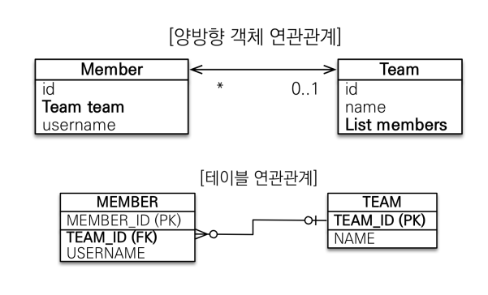
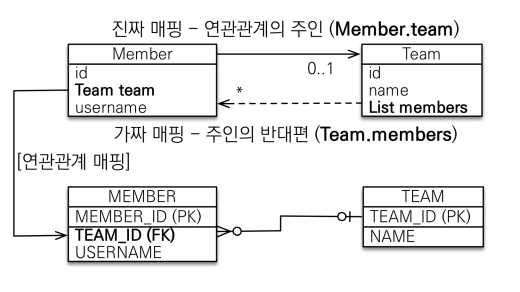

## 객체를 테이블에 맞추어 모델링
- 회원과 팀
- 회원은 하나의 팀에만 소속될 수 있다.
- 회원과 팀은 다대일 관계다. 

테이블에서 회원에게 외래키가 있다. 

```java
@Entity
 public class Member {
 @Id @GeneratedValue
 private Long id;
 @Column(name = "USERNAME")
 private String name;
 @Column(name = "TEAM_ID")
 private Long teamId;
 …
 }
 @Entity
 public class Team {
 @Id @GeneratedValue
 private Long id;
 private String name;
 …
 }
 ```

 Member 클래스에 teamId가 있는게 어색하다. 객체지향스럽지 않다. 
 이렇게 모델링하면 협력관계를 만들 수 없다. 

## 단방향 연관관계
Member N -- 1 Team : ManyToOne

```java
@Entity
 public class Member {
 @Id @GeneratedValue
 private Long id;
 @Column(name = "USERNAME")
 private String name;
 private int age;
// @Column(name = "TEAM_ID")
// private Long teamId;
 @ManyToOne
 @JoinColumn(name = "TEAM_ID")
 private Team team;
 ```

 teamId로 team을 찾지 않고 바로 team을 가져올 수 있다.

 ```java
 //조회
 Member findMember = em.find(Member.class, member.getId());
//참조를 사용해서 연관관계 조회
 Team findTeam = findMember.getTeam();
 ```

 ## 양방향 매핑
  - 테이블은 둘 중 하나만 알면 다 알수 있다.
  - 객체는 멤버 -> 팀 은 알수있지만 팀 -> 멤버는 알수 없음.
  
  양방향 설정하기
  ```java
  @Entity
 public class Team {
    @Id @GeneratedValue
    private Long id;
    private String name;
    @OneToMany(mappedBy = "team") //Member의 team과 매핑
    List<Member> members = new ArrayList<Member>();
    …
 }
  ```

  객체는 왠만하면 단방향이 좋다.
  `mappedBy`
  - 객체와 테이블간의 관계를 맺는 차이 
  - 객체 연관관계 = 2개
    - member <-> team 그냥 서로다른 단방향 연관관계가 2개인거다.
  - 테이블 연관관계 = 1개(외래키)
  - 팀입장에서도 member를 조인하면 member를 알 수 있다.
  ```sql
    SELECT *
    FROM MEMBER M
    JOIN TEAM T ON M.TEAM_ID = T.TEAM_ID

    SELECT *
    FROM TEAM T
    JOIN MEMBER M ON T.TEAM_ID = M.TEAM_ID
  ```
- 

## 연관관계 주인(Owner)
양방향 매핑 규칙
- 객체의 두 관계 중 하나를 연관관계의 주인으로 지정
- 연관관계의 주인마이 외래키를 관리(등록,수정)
- 주인이 아닌쪽은 읽기만 가능
- 주인은 mappedBy 속성 사용X
- 주인이 아니면 mappedBy 속성으로 주인 지정

## 누구를 주인으로?
- 외래키가 있는 곳을 주인으로 해라
- 여기서는 member.team이 연관관계의 주인
  
- 이모델로 90퍼센트는 해결된다.
- 외래키가 있는 곳이 무조건 다쪽이다.(연관관계 주인)

이렇게해야 Member객체를 바꿨을때 member에 대한 쿼리가 나간다.   
Team을 주인으로 하면 Team.members를 변경했을때 member에 대한 쿼리가 나가니까 나중에 헷갈리고 어려움.