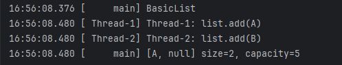
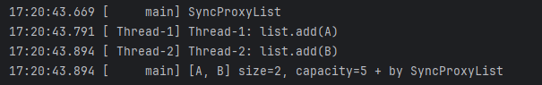

# 동시성 컬렉션이 필요한 이유
우리가 아는 컬렉션은 원자적이지 않다. 
간단한 컬렉션을 만들어보자.

```java
package thread.collection.simple;

public interface SimpleList {

	int size();

	void add(Object e);

	Object get(int index);
}

```

```java
public class BasicList implements SimpleList{
    
    private static final int DEFAULT_CAPACITY = 5;
    
    private Object[] elementData;
    private int size = 0;
    
    public BasicList() {
        this.elementData = new Object[DEFAULT_CAPACITY];
    }
		
    @Override
    public void add(Object e) {
        elementData[size] = e;
        sleep(100); // 멀티스레드 문제를 쉽게 확인하는 코드
        size++;
    }
}

```
여기서 add 메서드가 멀티스레드에 의해 동시에 실행하게되면 어떻게 될까?

# 동시성 문제
```java
@Override
public void add(Object e) {
    elementData[size] = e;
    sleep(100); // 멀티스레드 문제를 쉽게 확인하는 코드
    size++;
}
```
- 위 메서드는 단순히 데이터를 추가하는 것으로 끝나지 않는다.
- size++는 원자적이지 않다.
- 멀티스레드 상황에 안전하게 사용하려면 syncronized,lock을 사용해야한다. 

```java
private static void test(SimpleList list) throws InterruptedException {
    log(list.getClass().getSimpleName());
    // A를 리스트에 저장하는 코드
    Runnable addA = new Runnable() {
        @Override
        public void run() {
            list.add("A");
            log("Thread-1: list.add(A)");
        }
    };
    
    Runnable addB = new Runnable() {
        @Override
        public void run() {
            list.add("A");
            log("Thread-2: list.add(B)");
        }
    };
    
    Thread thread1 = new Thread(addA, "Thread-1");
    Thread thread2 = new Thread(addB, "Thread-2");
    thread1.start();
    thread2.start();
    thread1.join();
    thread2.join();
    log(list);
}
```
실행결과  

## 왜 이런결과가 나온걸까
우리가 자주 사용하는 자료 구조는 단순한 인터페이스를 제공하는것 처럼 보이지만 그 내부에서는 수많은 연산이 이루어진다. 
> add() 메서드를 보자.
> - "A"를 리스트에 넣을때 "B"를 넣는 스레드도 같이 들어온다. 
> - 그래서 동시에 elementData[0]에 값을 넣기때문에 타이밍에 따라 마지막에 넣은 값이 들어가게 된다. 
> - 그리고 size++는 같이 실행하기 때문에 2가된다.

컬렉션 프레임워크 대부분은 Thread-safe 하지 않다.  
멀티스레드 상황에서 여러 스레드가 도시에 컬렉션에 접근하는 경우라면 `java.util` 패키지가 제공하는 일반적인 컬렉션은 사용하면 안된다!

# 동기화
어떻게 동시성 문제를 해결할까 
답은간단하다. 메서드에 synchronized를 건다
```java
@Override
public synchronized void add(Object e) {
    elementData[size] = e;
    sleep(100); // 멀티스레드 문제를 쉽게 확인하는 코드
    size++;
}

@Override
public synchronized Object get(int index) {
    return elementData[index];
}

@Override
public synchronized String toString() {
    return Arrays.toString(Arrays.copyOf(elementData, size)) + " size=" + size + ", capacity=" + elementData.length;
}
```

문제가 또있다. 단일 스레드에서는 일반 컬렉션을 쓰는게 좋을것 같다.  
그렇다면 단일 스레드에서는 일반 컬렉션을 쓰고 
멀티스레드 상황에서는 일반 컬렉션을 모두 복사해서 synchronized를 붙이면 될까? 
비효율적으로 보인다. 

# 프록시 도입
일반컬렉션을 그대로 복사해서 만든다면 일반 컬렉션이 변경될때 복사한 코드도 변경해야한다. 기존 코드를 그대로 사용하면서 synchronized 기능만 살짝 추가하고 싶다면 어떻게 해야할까?
> 이럴때 사용하는 것이 바로 프록시다

## 프록시
우리말로 대리자, 대신 처리해주는 자.
- 나(클라이언트) -> 피자가게(서버)
- 나(클라이언트) -> (부탁) -> 친구(프록시) -> 피자 가게(서버)
프록시가 대신 synchronized를 걸어서 서버를 대신 호출해줄것이다. 

```java
package thread.collection.simple;

public class SyncProxyList implements SimpleList{

	private SimpleList target;

	public SyncProxyList(SimpleList target) {
		this.target = target;
	}

	@Override
	public synchronized int size() {
		return target.size();
	}

	@Override
	public synchronized void add(Object e) {
		target.add(e);
	}

	@Override
	public synchronized Object get(int index) {
		return target.get(index);
	}

	@Override
	public synchronized String toString() {
		return target.toString() + " + by " + this.getClass().getSimpleName();
	}
}

```


> test에서 SyncProxyList에서 add()를 호출하면 프록시에 들고 있는 BasicList의 add()를 호출한다.   
> synchronized가 있기때문에 락을 들고 임계영역으로 들어간다.  
> target의 add를 호출하고 실행이 끝나면 흐름이 다시 프록시 리스트의 add로 돌아오고 락을 반납하고 실행이 종료된다. 


test 메서드는 SimpleList라는 인터페이스에만 의존한다.
- 이것을 추상화에 의존한다고한다.
- SimpleList하나로 SimpleList 인터페이스의 모든 구현체를 동기화 할수 있다.

## 프록시 패턴
지금까지 구현한 것이 **프록시 패턴**이다.  
프록시 패턴(Proxy Pattern)은 객체지향 디자인 패턴 중 하나로, 어떤 객체에 대한 접근을 제어하기 위해 그 객체의 대리인 또는 인터페이스 역할을 하는 객체를 제공하는 패턴이다.  
프록시 객체는 실제 객체에 대한 참조를 유지하면서,
그 객체에 접근하거나 행동을 수행하기 전에 추가적인 처리를 할 수 있도록 한다.

프록시 패턴의 주요 목적
- 접근 제어: 실제 객체에 대한 접근을 제한하거나 통제할 수 있다.
- 성능 향상: 실제 객체의 생성을 지연시키거나 캐싱하여 성능을 최적화할 수 있다.
- 부가 기능 제공: 실제 객체에 추가적인 기능(로깅, 인증, 동기화 등)을 투명하게 제공할 수 있다.

# 자바 동시성 컬렉션
자바에서 제공하는 컬렉션 프레임워크들은 대부분 스레드 안전(Thread-Safe) 하지 않다.
그럼 모두 synchronized를 사용해서 동기화를 하면 안될까? 
> 동기화를 하지 않는게 가장 빠르다.  
> 성능이 저하될 수 있으므로 꼭필요한 경우에만 동기화를 적용하는 것이 필요하다.


자바는 프록시 리스트를 제공한다.
```java
List<String> list = Collections.synchronizedList(new ArrayList<>());
```

## 프록시 패턴의 단점
1. 동기화 오버헤드가 발생한다. 각 메서드 호출 시마다 동기화 비용이 추가된다. 이로 인해 성능 저하가 발생할 수 있다.
2. 전체 컬렉션에 대해 동기화가 이루어지기 때문에, 잠금 범위가 넓어질 수 있다.   
이는 잠금 경합(lock contention)을 증가시키고, 병렬 처리의 효율성을 저하시키는 요인이 된다. 모든 메서드에 대해 동기화를 적용하
다 보면, 특정 스레드가 컬렉션을 사용하고 있을 때 다른 스레드들이 대기해야 하는 상황이 빈번해질 수 있다.
3. 정교한 동기화가 불가능하다. synchronized 프록시를 사용하면 컬렉션 전체에 대한 동기화가 이루어지지만, 특정 부분이나 메서드에 대해 선택적으로 동기화를 적용하는 것은 어렵다. 이는 과도한 동기화로 이어질 수 있다

자바는 이러한 단점을 보완하기 위해 동시성 컬렉션을 제공한다.

# 동시성 컬렉션
java.util.concurrent 패키지에는 고성능 멀티스레드 환경을 지원하는 다양한 동시성 컬렉션 클래스들을 제공한다.

## 동시성 컬렉션의 종류
- List
  - CopyOnWriteArrayList
- Set
  - CopyOnWriteArraySet
  - ConcurrentSkipListSet
- Map
  - ConcurrentHashMap
  - ConcurrentSkipListMap
- Queue
  - ConcurrentLinkedQueue
- Deque
  - ConcurrentLinkedDeque

이 외의 동시성 컬렉션이 필요하다면 
`Collections.synchronizedxxx(...)`를 사용해야한다.

### 스레드를 차단하는 브로킹 큐
- BlockingQueue
  - ArrayBlockingQueue
  - LinkedBlockingQueue
  - PriorityBlockingQueue
  - SynchronousQueue
    - 생산자와 소비자가 큐 없이 직접 핸드오프 매커니즘 (직거래 개념)
  - DelayQueue

> 실무에서는 자바에서 제공하는 동시성 컬렉션을 사용하자