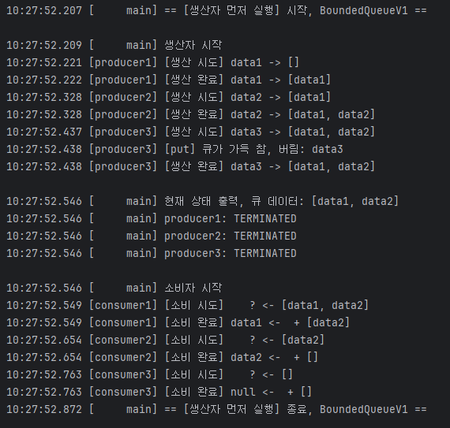
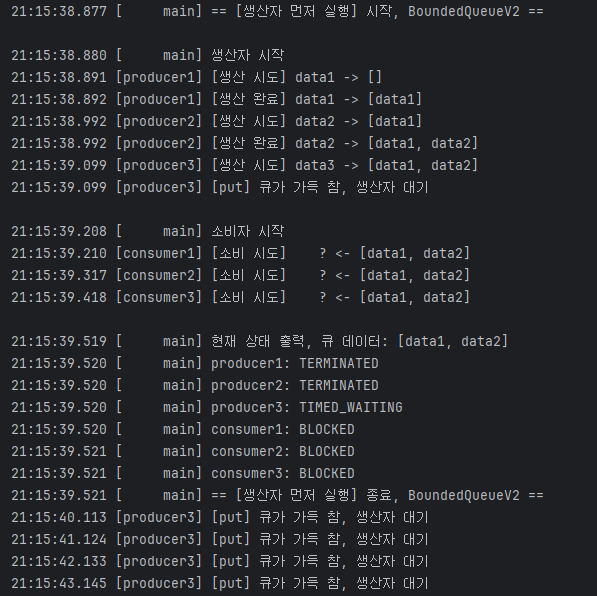
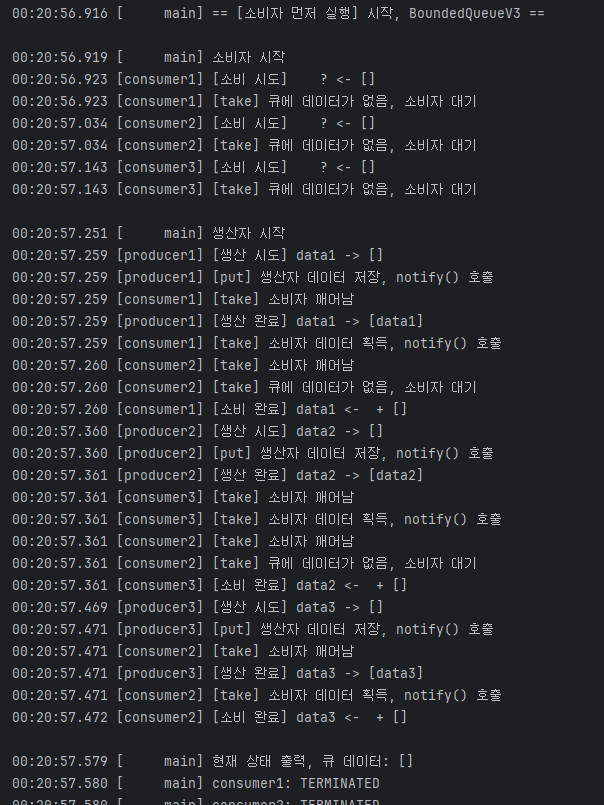

# 생산자 소비자 문제
생산자 스레드와 소비자 스레드가 특정 자원을 함께 생산하고 소비하면서 발생하는 문제다.
> **한정된 버퍼문제** 라고도 한다.   
> 생산자와 소비자 중간에 있는 버퍼의 크기가 한정되어 있기 때문에 발생한다.

생산자가 데이터를 생산하고 버퍼에서 데이터를 보관한다.
소비자는 버퍼에서 데이터를 가져와서 사용한다.
만약 버퍼가 가득차면 생산자는 새료운 음료를 생산하기전에 공간이 생길때까지 기다려야한다.
반대로, 버퍼가 비어있으면 소비자는 데이터가 버퍼에 들어올때 까지 기다려야한다.

- 생산자(Producer): 데이터를 생성하는 역할
- 소비자(Consumer): 생성된 데이터를 사용하는 역할
- 버퍼(Buffer): 생산자가 생성한 데이터를 일시적으로 저장하는 공간한정된 크기를 가지며, 생산자와 소비자가 버퍼를 통해 데이터를 주고받는다. (ex.프린터 큐)

## 비유1. 레스토랑 주방과 손님
- 생산자 - 주방 요리사
- 소비자 - 레스토랑 손님
- 버퍼 - 준비된 음식이 놓이는 서빙 카운터

## 비유2. 음료 공장과 상점
- 생산자 - 음료공장
- 소비자 - 상점
- 버퍼 - 창고


```java
public class BoundedQueueV1 implements BoundedQueue{
	@Override
	public synchronized void  put(String data) {}
	@Override
	public synchronized String take() {}		
}
```
같은 인스턴스이기 때문에 put을 사용하고 있다면 take도 다른 스레드는 사용하지 못한다.

## 생산자 소비자 문제 예제 Version1
1. 생산자는 데이터를 생산하고 소비자는 데이터를 소비한다.
2. 예제 상황은 아래와 같이 두가지로 설정한다..
- 생산자 스레드 3개가 생성되고 데이터를 생산한다. 
- 소비자 스레드 3개가 생성되고 데이터를 소비한다. 
```java
	//1. BoundedQueue 선택
    BoundedQueue queue = new BoundedQueueV1(2);

    //2. 생산자, 소비자 실행 순서 선택, 반드시 하나만 선택!
    produceFirst(queue); //생산자 먼저 실행
    consumerFirst(queue); //소비자 먼저 실행
```
큐에는 최대 두개의 데이터만 들어갈 수 있다.

## 생산자 먼저 실행되는경우
```java
Main.java
private static void produceFirst(BoundedQueue queue) {
    log("== [생산자 먼저 실행] 시작, " + queue.getClass().getSimpleName() + " ==");
    ArrayList<Thread> threads = new ArrayList<>();
    startProducer(queue, threads);
    printAllState(queue, threads);
    startConsumer(queue, threads);
    log("== [생산자 먼저 실행] 종료, " + queue.getClass().getSimpleName() + " ==");
}
```
생산자는 세개의 스레드를 생성하고 실행한다. 
```java
private static void startProducer(BoundedQueue queue, ArrayList<Thread> threads) {
    for (int i = 1; i <= 3; i++) {
        Thread producer = new Thread(new ProducerTask(queue, "data" + i), "producer" + i);
        threads.add(producer);
        producer.start();
        sleep(100);
    }
}
```
소비자도 세개의 스레드를 생성하고 실행한다.
```java
private static void startConsumer(BoundedQueue queue, ArrayList<Thread> threads) {
    for (int i = 1; i <= 3; i++) {
        Thread consumer = new Thread(new ConsumerTask(queue), "consumer" + i);
        threads.add(consumer);
        consumer.start();
        sleep(100);
    }
}
```
### 실행 로그

--- 


---
생산자가 버퍼에 최대사이즈 크기인 2개의 데이터가 들어있으므로 data3를 기다리지 않고 버리게된다. 어떻게 해결할 수 있을까?   
데이터가 다 차있다면 버퍼에 공간이 생길때까지 기다렸다가 데이터를 넣는 방법으로 구현하면 될것같다. 

또 소비자도 데이터가 없으면 null을 반환하지 않고 기다리는 방법으로 구현하면 될것같다.

# 생산자 소비자 문제 예제 Version2

```java
@Override
	public synchronized void  put(String data) {
		while (queue.size() == max) {
			log("[put] 큐가 가득 참, 생산자 대기");
				sleep(1000);
			return;
		}
		queue.offer(data);
	}

	@Override
	public synchronized String take() {
		while (queue.isEmpty()) {
			log("[take] 큐에 데이터가 없음, 소비자 대기");
			sleep(1000);
		}
		return queue.poll();
	}
```
## 실행 로그



무한대기 문제가 발생한다. p3는 데이터를 큐에 넣기 위해 락을 획득해서 임계영역에 접근했다. 
이후 c1,c2,c3가 데이터를 얻기 위해 임계영역에 접근하지만 p3가 락을 들고 루프를 돌고 있기 때문에 다른 스레드들은 큐에 접근도 못하고 BLOCKED 상태가 된다.

이런 문제를 해결하기 위해 
대기하는 동안 다른 스레드에게 락을 양보하면 어떨까? 그러면 다른 스레드가 버퍼에 데이터를 채우거나 가져갈 수 있을 것이다.

> 락을 가지고 대기하는 스레드가 대기하는 동안 다른 스레드에게 락을 양보할 수 있다면, 이문제를 쉽게 풀 수 있다. 
> * 자바의 Object.wait(), Object.notify()는 스레드가 대기하는 동안 다른스레드에게 양보하는 기능을 제공한다.


# 생산자 소비자 문제 예제 Version3.
- `Object.wait()`  
  - 현재 스레드가 가진 락을 반납하고 대기(WAITING)한다. 
  `synchronized` 블록이나 메서드에서 락을 소유하고 있을 때만 호출할 수 있다. 
- `Object.nofity()`
  - 대기중인 스레드 중 하나를 꺠운다. 
- `Object.notifyAll()`
  - 대기 중인 모든 스레드를 깨운다.

```java
@Override
public synchronized void  put(String data) {
    while (queue.size() == max) {
        log("[put] 큐가 가득 참, 생산자 대기");
        try {
            wait(); // RUNNABLE -> WATING, 락 반납
            log("[put] 생산자 깨어남");
        } catch (InterruptedException e) {
            throw new RuntimeException(e);
        }
    }
    queue.offer(data);
    log("[put] 생산자 데이터 저장, notify() 호출");
    notify(); // 대기 스레드, WAIT -> BLOCKED
}

@Override
public synchronized String take() {
    while (queue.isEmpty()) {
        log("[take] 큐에 데이터가 없음, 소비자 대기");
        try {
            wait();
            log("[take] 소비자 깨어남");
        } catch (InterruptedException e) {
            throw new RuntimeException(e);
        }
    }
		
    String data = queue.poll();
    log("[take] 소비자 데이터 획득, notify() 호출");
    notify(); // 대기 스레드, WAIT -> BLOCKED
    return data;
}
```

## 스레드 대기집합
모든 객체는 모니터락과 대기집합을 가지고 있다.  
wait() 호출 시 락을 반납하고 스레드의 상태가 WAITING으로 변경된다.   
이후 스레드 대기집합에서 관리된다.

notify()를 호출하면 대기집합에 있는 wait 상태의 스레드를 깨운다. 
그런데 스레드가 꺠어난다고 바로동작하는 것이 아니다. 깨어났을때 아직 자고있는 스레드를 깨운 스레드가 임계영역안에 있기 때문이다. 그래서 RUNNABLE 상태로 되지않고 WAITING -> BLOCKED 상태가 된다.

- 만약 WAITING 상태의 스레드가 여러개라면 어떤 스레드가 깨어날까? 정답은 "예측할 수 없다"이다. JVM 버전환경등에 따라 달라진다.
- 만약 c1이 작업이 완료되고 notify()로 대기 집합에 있는 스레드를 깨웠는데 c2,c3만 대기집합에 있다면, c2가 일어나서 데이터가 없음을 보고 다시 대기집합에 들어간다
- **같은 종류의 스레드를 꺠우기 때문에** 비효율적이긴 하나, 결과에는 문제가 없다. 약간 돌아갈뿐..
- 깨어난 스레드는 락을 얻고나면 wait() 호출한 부분부터 실행된다. 

> 생산자는 소바자만, 소비자는 생산자만 깨울수 있다면 어떨까?
## Object -wait, notify- 한계


> 스레드기아: 특정 스레드가 대기집합에서 스레드 실행 순서를 계속 얻지 못해서 실행되지 않는 상황

`notifyAll()`은 대기집합에 있는 모든 스레드를 깨워 스레드 기아 문제는 막을 수 있지만 비효율을 막지는 못한다.

# 생산자 소비자 문제 예제 Version4. Lock Condition

생산자 스레드가 대기하는 대기 집합과 소비자 스레드가 대기하는 대기 집합을 둘로 나눈다. 그리고 생산자 스레드가 소비자 스레드가 대기하는 대기집합에 알려주고, 소비자 스레드는 생산자 스레드가 대기하는 대기집합에만 알려주면된다.

1. synchronized,wait(),notify() -> Lock(),ReentrantLock()
생산자의 대기집합과 소비자의 대기집합 분리전 코드
```java
@Override
public void  put(String data) {
    lock.lock();
    try {
        while (queue.size() == max) {
            log("[put] 큐가 가득 참, 생산자 대기");
            try {
                condition.await(); //condition에서 대기집합을 제공
                log("[put] 생산자 깨어남");
            } catch (InterruptedException e) {
                throw new RuntimeException(e);
            }
        }
        queue.offer(data);
        log("[put] 생산자 데이터 저장, notify() 호출");
        condition.signal(); //condition에서 대기집합을 제공
    } finally {
        lock.unlock();
    }
}

@Override
public String take() {
    lock.lock();
    try {
        while (queue.isEmpty()) {
            log("[take] 큐에 데이터가 없음, 소비자 대기");
            try {
                condition.await();
                log("[take] 소비자 깨어남");
            } catch (InterruptedException e) {
                throw new RuntimeException(e);
            }
        }
        String data = queue.poll();
        log("[take] 소비자 데이터 획득, notify() 호출");
        condition.signal();
        return data;
    } finally {
        lock.unlock();
    }
}
```

## Condition
- Condition 은 ReentrantLock 을 사용하는 스레드가 대기하는 스레드 대기 공간이다.
- `lock.newCondition()` 메서드를 호출하면 스레드 대기 공간이 만들어진다. Lock(ReentrantLock) 의 스레드 대기 공간은 이렇게 만들 수 있다.  

- condition.await() -> wait()
- condition.signal() -> notify()


# Version 6.
생산자의 대기집합과 소비자의 대기집합 분리 후 코드 
락은 하나를 사용하고 wait() 하는 공간이 다르고 notify() 할때 호출하는 대기공간이 다르다. 
```java
import static util.MyLogger.log;

public class BoundedQueueV5 implements BoundedQueue{
  private final Lock lock = new ReentrantLock();
  
  // 락은 하나인데 대기공간은 두개이다.
  private final Condition producerCond = lock.newCondition();
  private final Condition consumerCond = lock.newCondition();
  
  private final Queue<String> queue = new ArrayDeque<>();
  private final int max;
  
  public BoundedQueueV5(int max) {
    this.max = max;
  }
  
  @Override
  public void  put(String data) {
      lock.lock();
      try {
          while (queue.size() == max) {
              log("[put] 큐가 가득 참, 생산자 대기");
              try {
                  producerCond.await(); //condition에서 대기집합을 제공
                  log("[put] 생산자 깨어남");
              } catch (InterruptedException e) {
                  throw new RuntimeException(e);
              }
          }
          queue.offer(data);
          log("[put] 생산자 데이터 저장, consumerCond.signal() 호출");
          consumerCond.signal(); //condition에서 대기집합을 제공
      } finally {
          lock.unlock();
      }
  }
  
  @Override
  public String take() {
      lock.lock();
  
      try {
          while (queue.isEmpty()) {
              log("[take] 큐에 데이터가 없음, 소비자 대기");
              try {
                  consumerCond.await();
                  log("[take] 소비자 깨어남");
              } catch (InterruptedException e) {
                  throw new RuntimeException(e);
              }
          }
          String data = queue.poll();
          log("[take] 소비자 데이터 획득, producerCond.signal() 호출");
          producerCond.signal();
          return data;
      } finally {
          lock.unlock();
      }
  }
}

```

# 실행 로그



자바의 모든 객체 인스턴스는 멀티스레드와 임계영역을 다루기위해 내부에 3가지 기본 요소를 가진다.
- 모니터락
- 락 대기집합(모니터락 대기집합) - 1차 대기소
- 스레드 대기 집합 - 2차 대기소

## synchronized vs ReentrantLock 대기 
- ReentrantLock 도 2가지의 단계의 대기 상태가 존재한다. 
- 같은 개념을 구현한 것이기 때문에 비슷하다. 

### Lock(RentrantLock)
대기1: ReentrantLock 락 획득 대기 
- ReentrantLock의 대기 큐에서 관리
- WAITING 상태로 락 획득 대기
- lock.lock() 을 호출 했을때 락이 없으면 대기
- 다른 스레드가 unlock()을 호출 했을때 대기가 풀리며 락 획득 시도
--- 

## 정리
생산자 소비자 문제는 멀티스레드의 기본기를 배울 수 있는 가장 좋은 예시이다.
자바는 우리가 구현한 BoundedQueue를 BlockingQueue라는 이름으로 만들어 두었다.


---
참고: 김영한의 실전자바 - 고급1편 멀티스레드와 동시성
