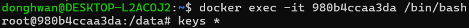
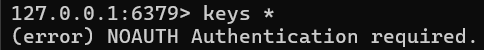
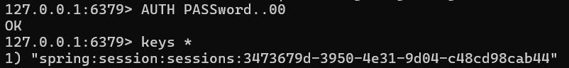

# WSL 내부 Redis에 접속해 REDIS 실행하기

먼저 실행중인 redis 컨테이너로 진입합니다.

```
docker exec -it 980b4ccaa3da /bin/bash
```


위와같이 root@[컨테이너ID] 가 보인다. 컨테이너에 잘 들어온것 같다.
컨테이너 내부에서 redis를 실행해줘야한다.

아래 명령어를 실행해 컨테이너 내부에서 redis를 실행해보자
```
redis-cli
```


redis를 실행해 redis 내부로 들어왔다. 
명령어를 실행하니 인증이 되지 않았다는 메시지가 보인다.  
redis 비밀번호를 입력하여 인증이 필요하다.
```
AUTH <비밀번호>
```

인증성공


# CRUD


모든 키 조회
```
keys *
```

SET 
```
set [key] [value]
```

## 조회
> 조회는 값 타입에 따라 조회하는 명령어가 다르다.

type 조회 
```
type [key]
```

타입|명령어
--|--
GET| 문자열 값 조회
HGETALL| 해시 값 조회
LRANGE| 리스트 값 조회
SMEMBERS| 셋 값 조회
ZRANGE| 정렬된 집합 값 조회

문자열 조회
```
GET [key]
```

리스트 조회 0,-1을 붙여 리스트의 모든 요소를 조회한다.
```
LRANGE [키] 0 -1
```
