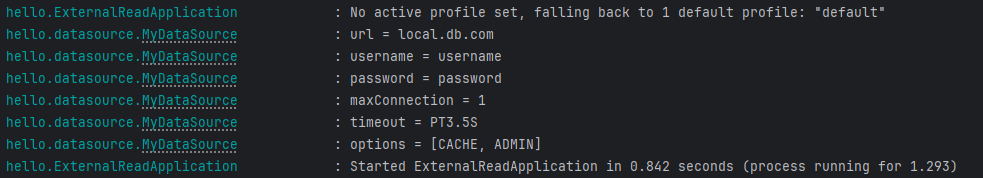

# 외부설정 파일 읽기

환경변수에는 주로 4가지가 있있습니다.
- OS 환경 변수: OS에서 지원하는 외부 설정, 해당 OS를 사용하는 모든 프로세스에서 사용
- 자바 시스템 속성: 자바에서 지원하는 외부 설정, 해당 JVM안에서 사용
- 자바 커맨드 라인 인수: 커맨드 라인에서 전달하는 외부 설정, 실행시 main(args) 메서드에서 사용
- 외부 파일(설정 데이터): 프로그램에서 외부 파일을 직접 읽어서 사용

오늘은 4번째 외부 파일을 읽는 방법에 대해 알아보겠습니다.
`application.properties` 혹은 `application.yml` 파일을 통해 스프링은 Environment 인터페이스를 통해 
환경변수를 가져올 수 있도록 추상화 했습니다. 

```java
@Slf4j
public class MyDataSource {

	private String url;
	private String username;
	private String password;
	private int maxConnection;
	private Duration timeout;
	private List<String> options;

	public MyDataSource(String url, String username, String password, int maxConnection, Duration timeout, List<String> options) {
		this.url = url;
		this.username = username;
		this.password = password;
		this.maxConnection = maxConnection;
		this.timeout = timeout;
		this.options = options;
	}

	@PostConstruct
	public void init() {
		log.info("url = {}",url);
		log.info("username = {}",username);
		log.info("password = {}",password);
		log.info("maxConnection = {}",maxConnection);
		log.info("timeout = {}",timeout);
		log.info("options = {}",options);
	}
}
```

datasource의 데이터를 외부파일에서 읽어야 할 경우 application.yml 파일에 있는 값을 읽을 수 있습니다. 
```yml
my:
  datasource:
    password: password
    etc:
      max-connection: 1
      timeout: 3500ms
      options: CACHE,ADMIN
    url: local.db.com
    username: username
```

MyDataSource를 빈으로 등록하여 dataSource값을 설정합니다.
```java
@Configuration
public class MyDataSourceEnvConfig {

	private final Environment env;

	public MyDataSourceEnvConfig(Environment env) {
		this.env = env;
	}

	@Bean
	public MyDataSource myDataSource() {
		String url = env.getProperty("my.datasource.url");
		String username = env.getProperty("my.datasource.username");
		String password = env.getProperty("my.datasource.password");
		int maxConnection = env.getProperty("my.datasource.etc.max-connection",Integer.class);
		Duration timeout = env.getProperty("my.datasource.etc.timeout",Duration.class);
		List<String> options = env.getProperty("my.datasource.etc.options", List.class);

		return new MyDataSource(url, username, password, maxConnection, timeout, options);
	}
}
```

결과값


하지만 이런 방법은 매번 Environment를 선언하고 getProperty()를 호출해야합니다. 번롭습니다. 
스프링에서는 이런 설정 파일 값을 간편하게 읽을 수 있는 `@Value` 어노테이션을 제공합니다.

# @Value

사용할때는 `@Value("${my.datasource.username}")` 처럼 인자로 application 파일에 있는 변수를 `${}`안에 넣어주면 된다. 

예시코드를 보자.

```java
@Slf4j
@Configuration
public class MyDataSourceValueConfig {

	//내부에서 Environment를 사용
	@Value("${my.datasource.username}")
	private String url;
	@Value("${my.datasource.username}")
	private String username;
	@Value("${my.datasource.password}")
	private String password;
	@Value("${my.datasource.etc.max-connection:2}")
	private int maxConnection;
	@Value("${my.datasource.etc.timeout}")
	private Duration timeout;
	@Value("${my.datasource.etc.options}")
	private List<String> options;


	@Bean
	public MyDataSource myDataSource1() {
		return new MyDataSource(url, username,password,maxConnection,timeout,options);
	}

}
```

@Value 내부에서는 Environment를 사용하여 값을 읽어온다. 뿐만 아니라 인자에서도 값을 바인딩하여 받을 수 있다.
```java
@Bean
public MyDataSource myDataSource2(
	@Value("${my.datasource.username}") String url,
	@Value("${my.datasource.username}") String username,
	@Value("${my.datasource.password}") String password,
	@Value("${my.datasource.etc.max-connection:2}") int maxConnection,
	@Value("${my.datasource.etc.timeout}") Duration timeout,
	@Value("${my.datasource.etc.options}") List<String> options) {

	return new MyDataSource(url, username,password,maxConnection,timeout,options);
}
```

`my.datasource.etc.max-connection:2`는 만약 `my.datasource.etc.max-connection` 값이 properties 파일에 없으면 기본값으로 2를 준다는 문법이다.

# @ConfigurationProperties

`@Value` 어노테이션도 단일변수를 가져와서 사용하기에는 좋지만,  여러 변수를 가져와야 할 경우에는 번거롭다는 단점이 있다. 이런 단점을 극복하기 위해 스프링은 `@ConfigurationProperties`를 제공한다. 

@ConfigurationProperties는 사용해야할 외부설정을 묶어 객체로 만든다. 이것을 타입 안전한 설정 속성이라고도 한다.

```java
@Data
@ConfigurationProperties("my.datasource")
public class MyDataSourcePropertiesV1 {

	private String url;
	private String username;
	private String password;
	private Etc etc;

	@Data
	public static class Etc {
		private int maxConnection;
		private Duration timeout;
		private List<String> options = new ArrayList<>();
	}
}
```

위와 같이 환경변수의 묶음을 객체로 만든다.
etc 클래스의 maxConnection을 보면 `application.yml`파일에 `my.datasource.etc.max-connection` 와 다른데 매핑이된다. 케밥 형식으로 되어있지만 스프링은 케밥 형식을 캐멀케이스로 변환해서 바인딩해준다.

```java
@Slf4j
@EnableConfigurationProperties(MyDataSourcePropertiesV1.class)
public class MyDataSourceConfigV1 {

	private final MyDataSourcePropertiesV1 properties;

	public MyDataSourceConfigV1(MyDataSourcePropertiesV1 properties) {
		this.properties = properties;
	}

	@Bean
	public MyDataSource dataSource() {
		return new MyDataSource(
			properties.getUrl(),
			properties.getUsername(),
			properties.getPassword(),
			properties.getEtc().getMaxConnection(),
			properties.getEtc().getTimeout(),
			properties.getEtc().getOptions());
	}
}
```
이후 `@EnableConfigurationProperties`로 변수묶음의 설정객체를 가져와 빈으로 등록한 후 객체로 properties의 값을 사용할 수 있다. 

마지막으로 읽기전용값이 되어야하는 properties값이 누군가에 의해 애플리케이션 단에서 변경될 수 있다는 점이다. 
이를 위해 객체의 Setter를 지우고 생성자를 사용하여 초기화할 수 있도록 해야한다. 
아래코드를 보자.

```java
@Getter
@ConfigurationProperties("my.datasource")
@Validated
public class MyDataSourcePropertiesV3 {

	@NotEmpty
	private String url;
	@NotEmpty
	private String username;
	@NotEmpty
	private String password;
	private Etc etc;

	public MyDataSourcePropertiesV3(String url, String username, String password, Etc etc) {
		this.url = url;
		this.username = username;
		this.password = password;
		this.etc = etc;
	}

	@Getter
	public static class Etc {
		@Min(1)
		@Max(999)
		private int maxConnection;
		@DurationMin(seconds = 1)
		@DurationMax(seconds = 60)
		private Duration timeout;
		private List<String> options = new ArrayList<>();

		public Etc(int maxConnection, Duration timeout, @DefaultValue("DEFAULT") List<String> options) {
			this.maxConnection = maxConnection;
			this.timeout = timeout;
			this.options = options;
		}
	}
}

```

세가지 기능을 추가하였다.
- Getter와 생성자를 작성하여 초기화된 이후에는 값변경을 하지 못하도록하였다. 
- `@DefaultValue` 를 사용해 `application.yml`에 값이 없을경우 기본값을 지정할 수 있도록 하였다.
- 자바 빈 검증기를 사용하여 할당될때 값의 유효성검사를 설정했다.

# @Profile

application 파일은 프로필을 사용해 환경별로 환경설정을 다르게 할 수 있습니다. 
```yml
my:
  datasource:
    url: local.db.com
    username: local_user
    password: local_pw
    etc:
      maxConnection: 2
      timeout: 60s
      options: LOCAL, CACHE

spring:
  profiles:
    active: prod
---
spring:
  config:
    activate:
      on-profile: dev
my:
  datasource:
    url: dev.db.com
    username: dev_user
    password: dev_pw
    etc:
      maxConnection: 10
      timeout: 60s
      options: DEV, CACHE
---
spring:
  config:
    activate:
      on-profile: prod
my:
  datasource:
    url: prod.db.com
    username: prod_user
    password: prod_pw
    etc:
      maxConnection: 50
      timeout: 10s
      options: PROD, CACHE
```
- yml 은 --- dash( - ) 3개를 사용해서 논리 파일을 구분한다.
- spring.config.active.on-profile 을 사용해서 프로필을 적용할 수 있다

설정값뿐 아니라 각환경마다 서로다른 빈을 등록해야한다면 어떻게 해야할까? 
`@Profile` 애노테이션을 사용하면 해당 프로필이 활성화된 경우에만 빈을 등록한다.

간단한 예제를 통해 `@Profile`의 쓰임을 알아보자.

DI를 적극 활용하기 위해 인터페이스 생성
```java
public interface PayClient {
	void pay(int money);
}
```

로컬환경에서의 결제 
```java
@Slf4j
public class LocalPayClient implements PayClient{
	@Override
	public void pay(int money) {
		log.info("로컬 결제 money={}",money);
	}
}
```
운영환경에서의 결제 
```java
@Slf4j
public class ProdPayClient implements PayClient {
 @Override
 public void pay(int money) {
 log.info("운영 결제 money={}", money);
 }
}
```
PayClient를 사용하는 서비스
```java
@Service
@RequiredArgsConstructor
public class OrderService {
 private final PayClient payClient;
 public void order(int money) {
 payClient.pay(money);
 }
}
```
빈 설정 `@Profile`을 사용하면 해당 프로필이 활성화된 경우에만 빈을 등록한다.
```java
@Slf4j
@Configuration
public class PayConfig {
	@Bean
	@Profile("default")
	public LocalPayClient localPayClient() {
		log.info("LocalPayClient 빈 등록");
		return new LocalPayClient();
	}
	@Bean
	@Profile("prod")
	public ProdPayClient prodPayClient() {
		log.info("ProdPayClient 빈 등록");
		return new ProdPayClient();
	}
}
```

`ApplicationRunner` 인터페이스를 사용하면 스프링 빈 초기화가 모두 끝나고 애플리케이션 로딩이 완료되는 시점에 run(args) 메서드를 호출해준다.
```java
@Component
@RequiredArgsConstructor
public class OrderRunner implements ApplicationRunner {
	private final OrderService orderService;

	@Override
	public void run(ApplicationArguments args) throws Exception {
		orderService.order(1000);
	}
}
```

```java
@Import(MyDataSourceConfigV3.class)
@SpringBootApplication(scanBasePackages = {"hello.datasource", "hello.pay"})
public class ExternalReadApplication {
	public static void main(String[] args) {
	SpringApplication.run(ExternalReadApplication.class, args);
 }
}
```


