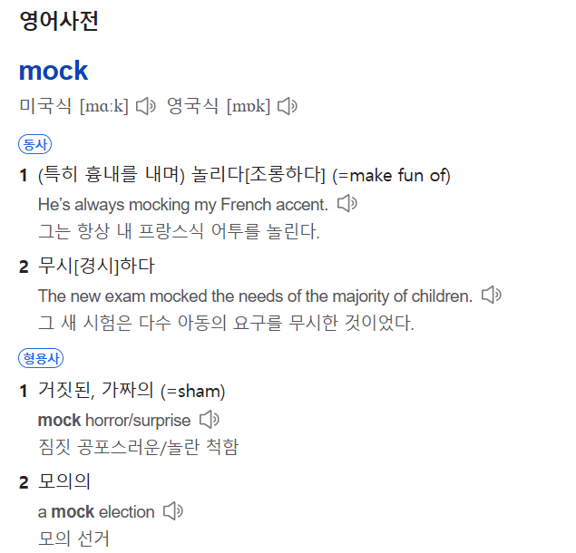
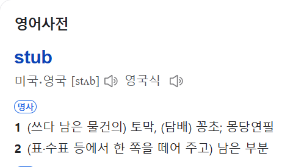

# Mockito 테스트 프레임워크
- Mock 이라는 가짜 객체를 생성하여, 테스트를 가능하도록 해주는 프레임워크
- 따라서 구현체가 없어도 테스트가 가능하기 때문에 일반적으로 단위 테스트에 많이 쓰인다.
- 
## Mock



## @Mock
```java
@ExtendWith(MockitoExtension.class)
public class MockTests {
    @Mock
    private OrderRepository orderRepository;
    @InjectMocks
    private OrderService orderService;   
}
```
> @InjectMocks를 사용하면 @Mock으로 만들어진 인스턴스들을 자동으로 주입해준다.
> (위 예시에서는 OrderService가 OrderRepository를 주입받는 클래스 존재)

## @InjectMock
Q) @InjectMocks가 붙은 객체는 가짜가 아닌가? 
A) @InjectMocks 자체는 가짜(Mock) 객체가 아닙니다.
-  `@InjectMocks`의 역할
@InjectMocks가 붙은 객체는 실제 객체(Real Object)로 생성됩니다.
단, 이 객체가 의존하는 다른 객체들은 @Mock이나 @Spy를 사용하여 가짜(Mock) 객체로 주입됩니다.

즉, Mockito는 @InjectMocks가 붙은 객체를 직접 생성하고, 필요한 의존성을 Mock으로 주입하는 역할을 합니다.

## @MockBean
```java
@SpringBootTest
public class MockTests {
    @MockBean
    private OrderRepository orderRepository;
    @Autowired
    private OrderService orderService;   
}
```
@MockBean이 붙으면 mock객체를 스프링 컨텍스트에 등록하게 된다. 그 후, @Autowired로 스프링 컨텍스트에 등록된 mock 객체들을 주입받아서 의존성 처리를 해준다.

만약 application context에 같은 타입의 빈이 존재한다면 해당 빈을 mock으로 교체한다. 같은 타입의 빈이 존재하지 않는다면, 해당 mock 객체를 빈으로 추가해준다. 이 어노테이션은 통합 테스트를 진행할 때에 mock을 사용해야하는 상황의 특정 빈의 경우에 유용하다.

 

(여기서 @MockBean으로 하고 @InjectMocks를 해주면 작동하지 않는다. 왜냐하면 @MockBean은 스프링 컨텍스트에 등록을 하여 사용되지만 @InjectMocks는 스프링 컨텍스트에서 빈을 찾지 않으므로 의존성 주입에 실패한다. 따라서 NPE가 발생한다.)

 

Mock 종류|	의존성 주입 Target
--|--
@Mock	|@InjectMocks
@MockBean|	@SpringBootTest

만약 통합 테스트라면 @MockBean을 사용하면 될 것이고, 여타 다른 spring 빈들이 필요가 없고 특정 빈들만 mock으로 가지고 있으면 된다면 @Mock을 이용한 테스트를 진행하면 될 것 같다.
## stub


## Verify
- Mock 객체의 호출여부와 호출 횟수를 검증하는 기능

참고> 
- https://velog.io/@kyukyu/Mockito-%ED%94%84%EB%A0%88%EC%9E%84-%EC%9B%8C%ED%81%AC
- https://www.baeldung.com/java-spring-mockito-mock-mockbean
- https://velog.io/@kyukyu/Mockito-%ED%94%84%EB%A0%88%EC%9E%84-%EC%9B%8C%ED%81%AC

