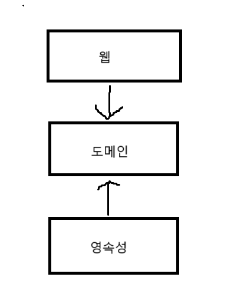
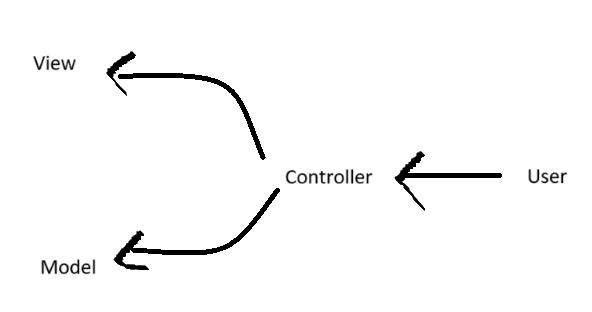
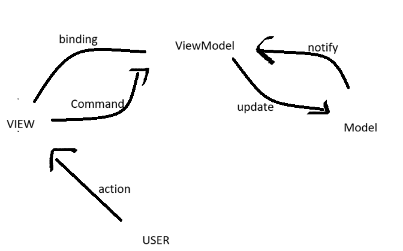
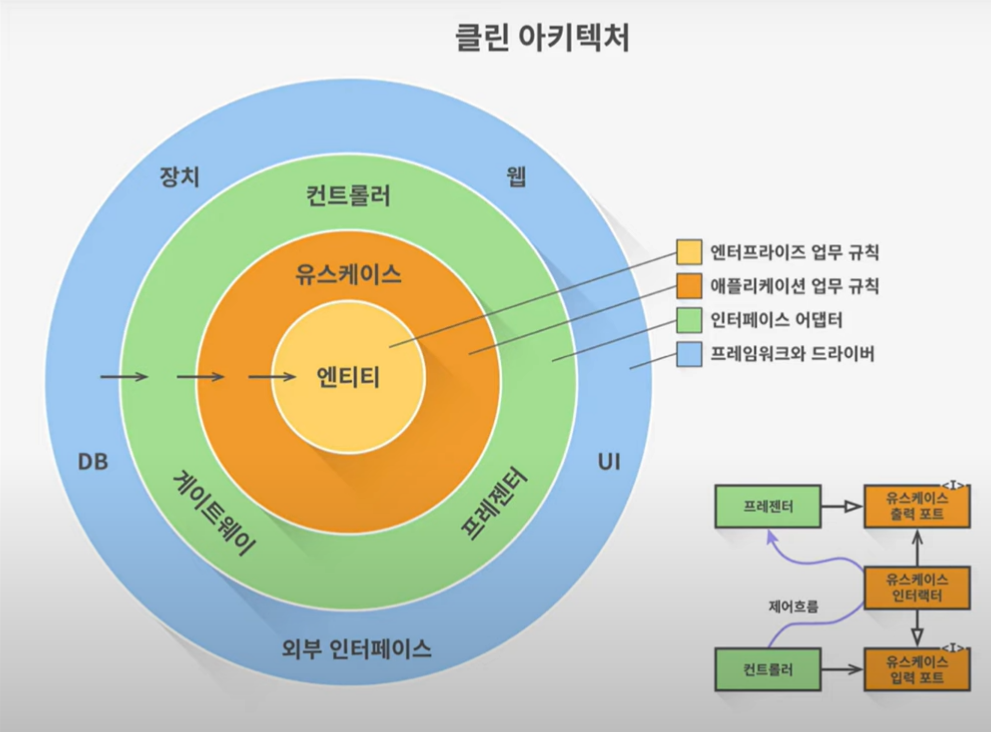
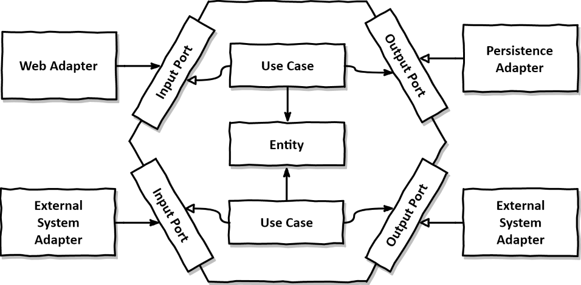
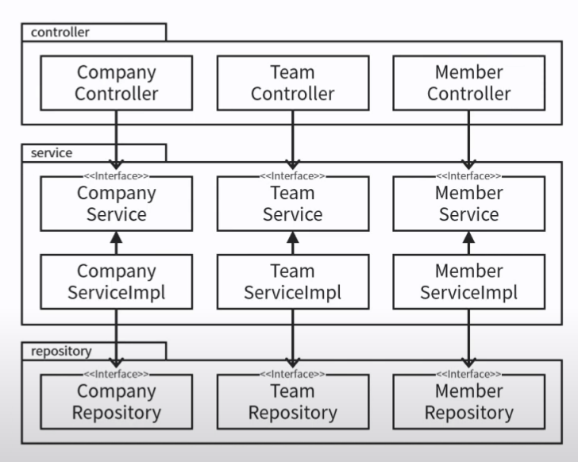
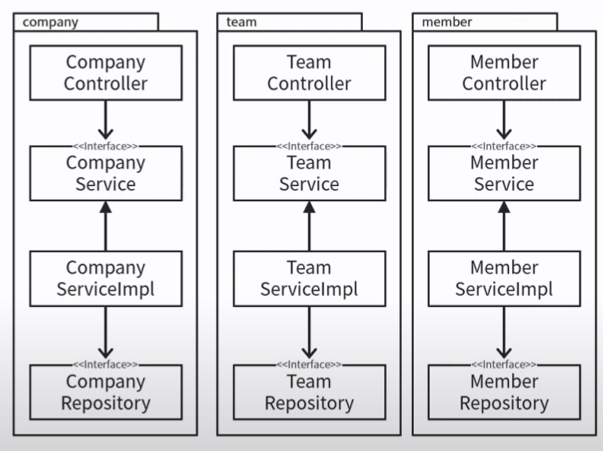
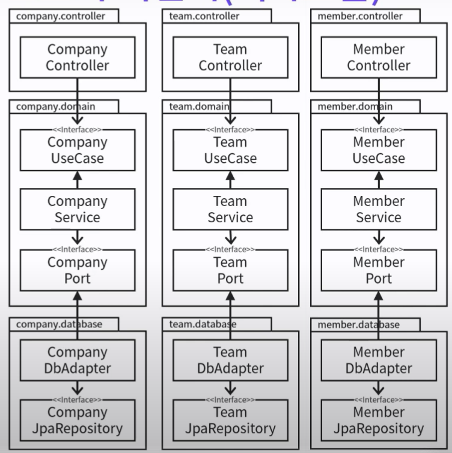

# 소프트웨어 아키텍처란?
앱 또는 스프트웨어 개발에서 코드를 구성하고 조직화 하는 방식

소프트웨어가 제공하는 가치는 기능과 구조가 있습니다.
여기에서 아키텍처는 **구조**에 대한 이야기입니다.

## 왜 필요할까
1. 코드를 구조화하고
2. 유지보수성을 높이고
3. 테스트가 가능하고
4. 재사용성이 높으며
5. 확장성 등의 측면
   
에서 유리함을 가져가기 위한, 즉, 개발 프로세스를 향상 시키기 위해 필요한 존재

## 아키텍처 패턴 
좋은 아키텍처를 잡기 위한 레시피 

### 📖패턴 사용법
1. **일단** 레시피를 따라해보기
2. 원칙들을 학습하고 이해한 후에 다시 레시피 대로 따라해보기
3. 각자의 프로젝트에 레시피를 적용해보기
4. 고민이 되는 지점들은 원칙에 맞게, 혹은 크게 벗어나지 않는 선에서 타협하며 적용해보기 

## 종류
- 계층형 아키텍처
  특징|장점|단점
    --|--|--
    전통적인 수평적 계층화 | - 구조 단순- 처음시작할떄 적합 - 보편적이라 익숙 | - 업무 도메인에 대해 아무것도 말해주지 않음 - 소프트웨어가 커지고 복잡해지면 조직화에 도움 안됨 - 데이터베이스 주도 설계가 된다.

- 클린 아키텍처
    특징|장점|단점
    --|--|--
    -도메인이 중심(의존성 역전을 이용) | - 규칙 단순 - 도메인이 세부 사항에 의존하지 않는다. - DDD 적용 용이(도메인 주도 설계) - 비즈니스 규칙에 집중이 쉽다.| -패키지 구조가 계층형보다 복잡하다. - 익숙하지 않아서 처음에 버벅일 수 있다. - 레퍼런스가 적다.|
  
  

- MVC

- MVVM - Model View ViewModel

## 🫧클린 아키텍처
>클린 아키텍처란? 소프트웨어를 계층으로 나누어 관심사를 분리하는 것.

여러 아키텍처를 하나로 통합을 시도했다.
- 공통의 목표: 관심사의 분리
- 공통의 핵심 규칙: 의존성의 방향은 안쪽, 고수준을 향한다.

### 우리는 왜 클린아키텍처를 사용해야 하는가? 
- 소스코드 전반을 쉽게 파악이 가능해진다.
- 수정 사항에 대한 대응이 쉬워진다.
- 다른 계층에 영향을 주지 않는다.
- 테스트가 쉬워진다.
- 높은 응집도, 낮은 결합도

이런 클린 아키텍처가 동작하기 위해서는 의존성 규칙을 지켜야 한다고 생각한다.   
모든 소스코드 의존성은 반드시 **외부에서 내부**로, **고수준 정책**을 향해야 한다고 말한다.
즉, 업무에서 업무 로직을 담당하는 코드들이 DB 또는 Web같이 구체적인 세부 사항에 의존하지 않아야한다.
이를 통해 업무로직(고수준 정책)은 세부사항들(저수준 정책)의 변경에 영향을 받지 않도록 할 수 있다. 

### 클린 아키텍처는 기준이 애매하다.
>왜? 핵심 규칙이 두가지 밖에 없다. 

### 애매할 것을 판단할 기준
1. 필요한 시스템을 만들고 유지보수하는데 투입되는 인력 최소화에 유리한가? 
2. 소스 코드 의존성이 안쪽으로, 고수준의 정책을 향하고 있는가?
3. 세부 사항이 변경되어도 도메인(핵심 규칙)에 변경이 없을 것인가?
4. 테스트하기 쉬운가?
5. 각각의 아키텍처 원칙들을 잘 지키고 있는가? 

### 클린아키텍처 이럴땐 쓰지마세요
- 소규모의 프로젝트를 진행할때 (학습시는 제외)
- 프로젝트 개발자 모두가 클린 아키텍처를 이해하고 있지 않을 때
- 모두가 사용하기로 합의하지 않았을 때 

### 꼭 다 지켜야 하나요? 
> 알아서, 적당히, 잘 ,조심스럽게 
해도되지만, 막 하지 말자 
처음부터 지름길로 가면 나중에 정석대로 못한다.
언제 지름길에서 돌아 나올지 항상 주시해야 한다.
어느 부분이 지름길인지 코드에 표시해두어야 한다.(주석 이용)

### 잘 모르겠는 것.
- JPA Entity와 Domain Entity를 분리? 
- JPA Repository는 어디에 해당하나
    - JPA Repository는 출력 포트가 아니라 어댑터다. 
- 유스케이스를 꼭 인터페이스로 뽑아야하나? 
    - controller가 service의 구현에 대해 너무 알지 못하도록 막기위해 존재재

### 클린아키텍처, 어떻게 공부해야되나 
도서
> 1. 만들면서 배우는 클린 아키텍처
>   저자: 톰 홈버그 
> 2. 클린 아키텍처(로버트 C.마틴)
> 로버트C마틴 > 별명은 엉클 밥

## 🎈헥사고날 아키텍처
구조

# 📂패키지 구조

계층형 패키지

기능기반 패키지

포트와 어댑터(헥사고날)

>참고: https://www.youtube.com/watch?v=V0PZmJ7eDvo
