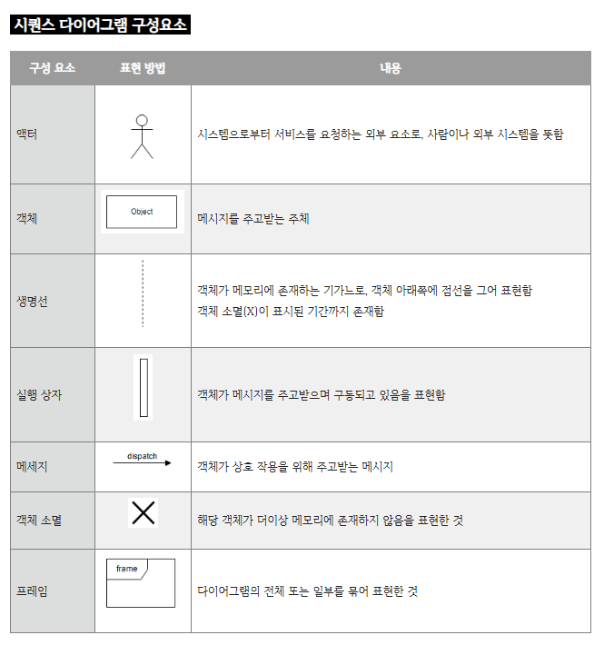
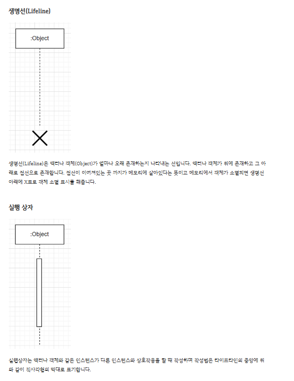
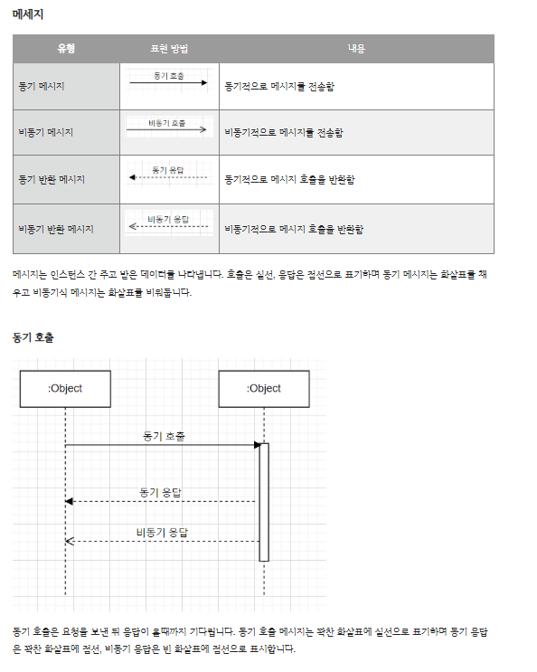

# 시퀀스 다이어그램이란?
- UML 다이어그램의 한 종류로 시스템이나 객체들이 메시지를 주고받으며 상호작용하는 과정을 표현하는 행위 다이어그램. 
- 현재 구축되어 있는 시스템이 어떻게 동작하고 있는지 표현하거나 신규 개발해야 할 시스템이 어떠한 시나리오로 흘러갈 지 쉽게 표현 할수 있어 자주 사용됩니다.

> 출처 : https://coding-factory.tistory.com/806

